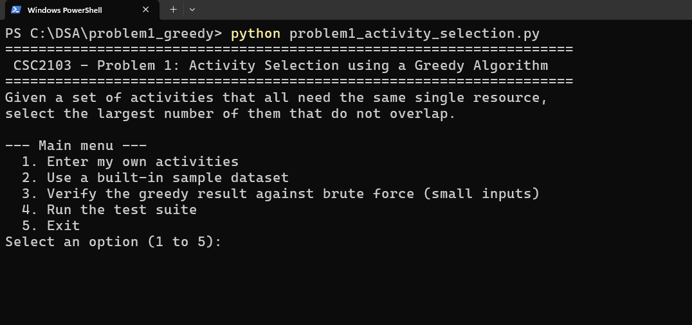

# Problem 1: Greedy Algorithm Implementation

## Problem Description

The Activity Selection Problem asks: given a set of activities, each with a
start time and an end time, and a single shared resource (e.g. one room, one
machine) that can only be used by one activity at a time, select the maximum
number of non-overlapping activities that can be performed using that
resource.

Formally, given activities A = {a1, a2, ..., an} where each activity ai has a
start time si and a finish time fi, the goal is to find the largest possible
subset of A such that no two selected activities overlap (i.e. for any two
selected activities, one must finish before or exactly when the other
starts).

## Greedy Strategy

The greedy choice used is: **always pick the activity that finishes earliest
among the remaining compatible activities.**

The algorithm works in two steps:

1. Sort all activities by their end (finish) time, ascending.
2. Walk through the sorted list once. Select the first activity. For every
   subsequent activity, select it only if its start time is greater than or
   equal to the end time of the most recently selected activity.

This choice works because finishing early leaves the most time available for
the activities that follow. Picking the activity that ends soonest never does
worse than any other valid choice. An exchange argument proves it: any optimal
solution can be rearranged to start with the earliest-finishing activity
without reducing how many activities it contains. The problem also has optimal
substructure. Once the earliest-finishing activity is chosen, what remains is
the same Activity Selection problem on the activities compatible with it.

The assignment rules do not allow a built-in `sort()` or `sorted()` call here,
because sorting is part of the core algorithmic task rather than formatting.
`manual_sort_by_end` implements insertion sort by hand instead.

## Input / Output Design

The program presents a five-option console menu:

1. Enter my own activities
2. Use a built-in sample dataset
3. Verify the greedy result against brute force (small inputs)
4. Run the test suite
5. Exit

Option 1 asks how many activities there are, then reads that many lines in
the form `name start end` (for example `A1 1 4`). The program validates every
entry. A non-numeric count, or a malformed activity line with the wrong number
of fields, non-numeric times, or a start time not before the end time,
produces a re-prompt instead of a crash. Option 2 instead offers a choice
of five built-in datasets (a textbook example, meeting-room bookings, an
all-overlapping set, a no-overlap set, and a back-to-back chain), so a
run can be reproduced without retyping activities. Option 3 runs the same
input through both the greedy algorithm and an exhaustive brute-force search
and reports whether they agree. Option 4 runs the built-in test suite.

The output for options 1-3 is a formatted table of the selected activities
(name, start, end) followed by a total count, or `"No activities selected."`
if the input was empty; each result is also passed through an independent
`verify_selection` check, printed as `Verification: PASSED - ...` or
`Verification: FAILED - ...`.

Example interaction (loading sample dataset 1, from
`sample_runs/output_01_textbook.txt`):

```
====================================================================
 CSC2103 - Problem 1: Activity Selection using a Greedy Algorithm
====================================================================
Given a set of activities that all need the same single resource,
select the largest number of them that do not overlap.

--- Main menu ---
  1. Enter my own activities
  2. Use a built-in sample dataset
  3. Verify the greedy result against brute force (small inputs)
  4. Run the test suite
  5. Exit
Select an option (1 to 5): 
--- Sample datasets ---
  1. Textbook example - 11 activities
  2. Meeting room bookings - 7 requests
  3. All overlapping - only one can run
  4. No overlaps - every activity fits
  5. Back-to-back chain - each starts as the last ends
Choose a dataset (1 to 5): Loaded: Textbook example - 11 activities

--- Input activities ---
  Name         Start    End     
  ------------ -------- --------
  A1           1        4       
  A2           3        5       
  A3           0        6       
  A4           5        7       
  A5           3        9       
  A6           5        9       
  A7           6        10      
  A8           8        11      
  A9           8        12      
  A10          2        14      
  A11          12       16      

--- Selected activities (greedy) ---
Name         Start    End     
A1           1        4       
A4           5        7       
A8           8        11      
A11          12       16      

Total selected: 4

Verification: PASSED - 4 activities, no overlaps

--- Main menu ---
  1. Enter my own activities
  2. Use a built-in sample dataset
  3. Verify the greedy result against brute force (small inputs)
  4. Run the test suite
  5. Exit
Select an option (1 to 5): 
Goodbye.
```

## Key Code Snippets

Manual sort by end time (hand-written, no built-in sort used):

```python
def manual_sort_by_end(activities):
    sorted_list = list(activities)
    for i in range(1, len(sorted_list)):
        current = sorted_list[i]
        j = i - 1
        while j >= 0 and sorted_list[j][2] > current[2]:
            sorted_list[j + 1] = sorted_list[j]
            j -= 1
        sorted_list[j + 1] = current
    return sorted_list
```

Greedy selection loop:

```python
def select_activities(activities):
    if not activities:
        return []

    sorted_activities = manual_sort_by_end(activities)
    selected = [sorted_activities[0]]
    last_end = sorted_activities[0][2]

    for activity in sorted_activities[1:]:
        start = activity[1]
        if start >= last_end:
            selected.append(activity)
            last_end = activity[2]

    return selected
```

Exhaustive reference implementation, used to check the greedy result:

```python
def brute_force_max_count(activities):
    if len(activities) > MAX_BRUTE_FORCE_N:
        raise ValueError(
            "brute force is limited to %d activities (got %d)"
            % (MAX_BRUTE_FORCE_N, len(activities)))

    best_count = 0
    best_subset = []

    for subset in generate_subsets(list(activities)):
        if len(subset) > best_count and is_feasible_set(subset):
            best_count = len(subset)
            best_subset = subset

    return best_count, best_subset
```

## Screenshots of Sample Runs

<!-- SCREENSHOTS GO HERE
Capture the following four screenshots and save them to report/screenshots/,
then replace this comment with four image links (one line each, with a
one-line caption), e.g.:
  
  Caption: the program's opening banner and main menu.

From problem1_greedy/, run:

1. problem1_menu.png
   Command:  python problem1_activity_selection.py
   Then just let it print the banner and the main menu (do not select an
   option yet, or select nothing further before capturing).
   Show: the banner and the "--- Main menu ---" listing options 1-5.

2. problem1_sample_run.png
   Command:  python problem1_activity_selection.py < sample_runs/input_01_textbook.txt
   Show: the "--- Selected activities (greedy) ---" table, the
   "Total selected: 4" line, and the "Verification: PASSED" line.

3. problem1_brute_force_match.png
   Command:  python problem1_activity_selection.py < sample_runs/input_04_brute_force.txt
   Show: the "Greedy result" and "Brute force result" tables and the
   "Verdict          : MATCH - the greedy choice found the optimum" line.

4. problem1_test_suite.png
   Command:  python problem1_activity_selection.py < sample_runs/input_05_test_suite.txt
   Show: the "TEST SUITE - expected vs actual" output ending in
   "7 of 7 tests passed."
-->
<!-- End of screenshot checklist -->

## Strengths and Limitations

**Strengths**
- Always produces the optimal (maximum-count) solution. The exchange argument
  shows this in theory, and the program checks it in practice: menu option 3
  compares the greedy result against an exhaustive search of all 2^n subsets,
  and the automated tests confirm the two agree on every sample dataset and
  test case.
- Simple and fast: after sorting, the selection pass is a single O(n) walk
  through the list.
- Handles edge cases cleanly: empty input, a single activity, fully
  overlapping activities, and activities that touch exactly at the boundary
  (one ending exactly when another starts) are all handled correctly and
  covered by automated tests.

**Limitations**
- The hand-written insertion sort is O(n^2) in the worst case, so a faster
  sort such as merge sort or quicksort would scale better on very large
  activity sets. It would still have to be written by hand to satisfy the
  assignment's no-built-in rule.
- The algorithm only handles a single shared resource. If there were
  multiple identical resources (e.g. 3 interchangeable rooms), this exact
  approach would need to be extended (e.g. run repeatedly, or track multiple
  "last end time" slots).
- Ties on end time are broken by whichever activity appears first in the
  input, because the sort is stable. This is a reasonable default, but the
  user cannot change it.
